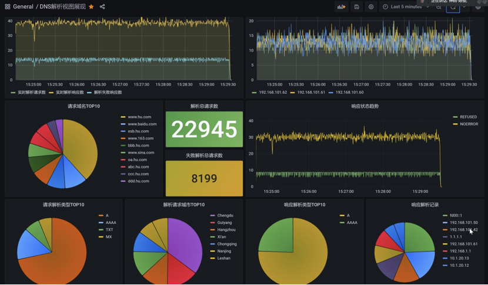
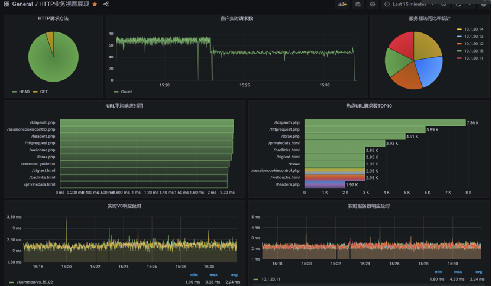
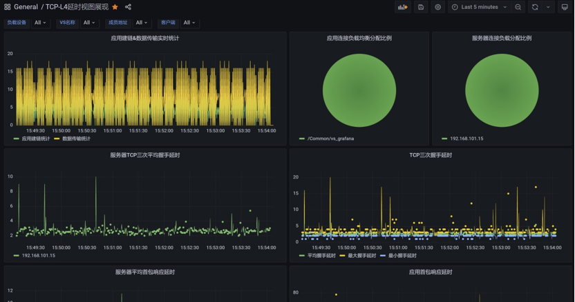
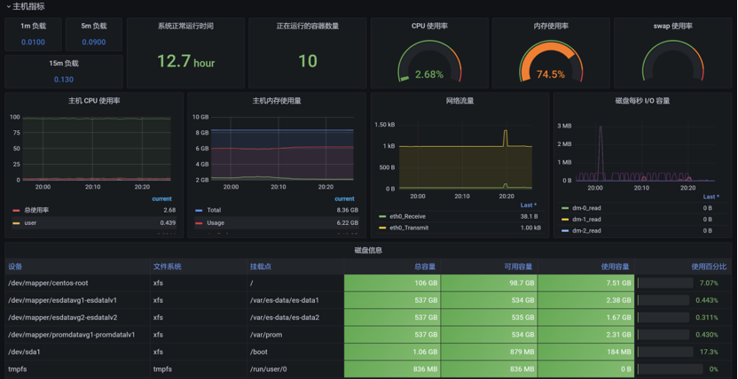
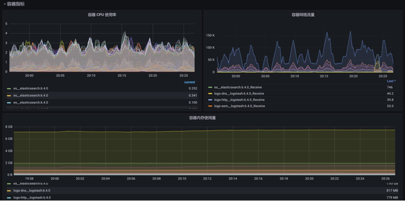

这是一个全新的可视化展现，由 **胡易鹏** 提供支持。

通过结合使用Prometheus+Elasticsearch+Grafana来构建F5设备状态及业务运行态势展示大屏。

* Prometheus结合snmp-exporter用于监控设备运行状态
* Elasticsearch结合F5 HSL展示业务运行态势
* Grafana用于大屏视图展示

在本目录下的word中，你可以看到完整且详细的安装与配置步骤。

| **Dashboard 模板名称** | **Grafana 数据源** | **功能**                |
| ----------------------- | --------------------- | ----------------------- |
| F5设备状态监控          | Prometheus            | 监控F5设备硬件状态      |
| Container&Node性能监控  | Prometheus            | 监控宿主机硬件状态      |
| HTTP业务视图展现        | Elasticsearch-http    | 展示F5 HTTP业务态势     |
| DNS解析视图展现         | Elasticsearch-dns     | 展示F5 DNS服务态势      |
| TCP-L4延时视图展现      | Elasticsearch-tcp     | 展示F5 L4业务建链态势   |
| 安全防护态势视图展现    | Elasticsearch-asm     | 展示F5 Awaf安全防护态势 |

DNS解析可视化展示效果：

HTTP访问可视化效果：

TCP 连接时延展示效果：

安全防护态势展示效果：

主机指标监控展示效果：

容器监控指标展示效果：

